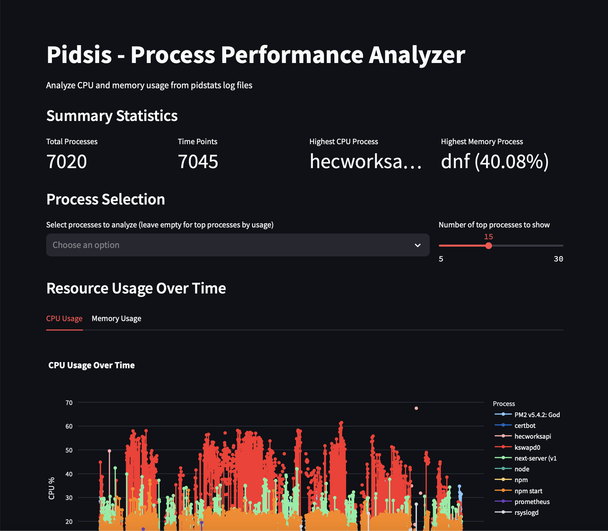

# pidsis

A Python package for parsing pidstats log files into pandas DataFrames.



## Notes:
Assumes uv is installed and available in the PATH.
- `uv` is a command line tool that allows you to run Python scripts with a virtual environment.

## Installation

```bash
uv venv

uv run install
```

## Local Development Setup

```bash
# Run tests
uv run pytest
```

## Server Setup

```bash
pidstat -ur 60 > /var/log/pidstats.log & disown $!
```

## Usage

```bash
# Run the parser and open the streamlit app
chmmod +x ./run.sh
./run.sh

# Just run the parser and use the matplotlib graphs
uv run main.py some/path/to/pidstats.log
```

## Project Structure

- `pidsis/` - Main package directory
  - `parser.py` - Core parsing logic
  - `dataframe.py` - DataFrame creation and manipulation
  - `utils.py` - Utility functions
  - `main.py` - Command-line interface
- `tests/` - Test directory
  - `data/` - Test data files
  - `test_parser.py` - Parser tests